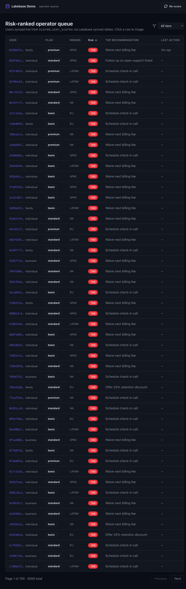

# Lakebase Reverse-ETL Demo

Reference implementation: a Databricks lakehouse computes per-user churn risk and next-best-action recommendations, **continuously syncs** them to **Lakebase Postgres**, and a **Databricks App** (FastAPI + React) lets operators triage the risk-ranked queue. Operator decisions write back to Lakebase, then flow back to UC for closed-loop learning. A Foundation Model panel generates a per-user rationale on demand.



The demo is generic B2C subscription data — translates 1:1 to healthcare member risk, fintech retention, SaaS churn, etc.

## Architecture

```
┌────────────────────── Lakehouse (UC) ──────────────────────┐
│  raw.users / raw.events / raw.subscriptions                │
│         │ pipeline 02 (features)                           │
│  curated.user_features                                     │
│         │ pipeline 03 (heuristic scorer)                   │
│  scored.user_scores  scored.recommendations                │
│         │                                  ▲ pipeline 04   │
│         │ continuous synced table          │ writeback CDC │
│         ▼                                  │               │
└─────────┼──────────────────────────────────┼───────────────┘
          │                                  │
┌─────────▼──────────── Lakebase ────────────┼───────────────┐
│  users / user_scores / recommendations  (synced, RO)       │
│  user_actions                            (app-owned, RW)   │
└─────────┬──────────────────────────────────▲───────────────┘
          │ psycopg pool (OAuth)             │ writes
┌─────────▼──────────── Databricks App ──────┴───────────────┐
│  FastAPI backend  ←→  React + Tailwind frontend            │
│  + Foundation Model API ("explain this score")             │
└────────────────────────────────────────────────────────────┘
```

## Prereqs

- Workspace with **Lakebase Autoscaling** enabled (FE-VM serverless workspaces do).
- A UC catalog where you have **`USE CATALOG` + `CREATE SCHEMA`** privileges. The bundle does **not** create the catalog (that needs metastore-admin perms).
- [`databricks` CLI **v0.285.0+**](https://docs.databricks.com/aws/en/dev-tools/cli/install) authenticated to that workspace (`databricks auth login --host <url> --profile <name>`).
- `psql` (16+), `jq`, `envsubst`, `node` (≥20), `npm`, [`uv`](https://docs.astral.sh/uv/getting-started/installation/).
  - macOS: `brew install postgresql@16 jq gettext`
  - Linux: `apt install postgresql-client jq gettext-base`
- A Foundation Model serving endpoint with `CAN_QUERY` for your identity (defaults to `databricks-claude-sonnet-4-5`).

## Quickstart

```bash
git clone <repo-url> lakebase-demo && cd lakebase-demo
./scripts/bootstrap.sh -p <your-profile> --catalog <existing-catalog>
```

`--catalog` is required if you don't have a catalog literally named `main`. Other knobs (`schema_prefix`, `lakebase_project_id`, `serving_endpoint`) live in `databricks.yml` under `variables:` — override at runtime via `BUNDLE_VAR_<name>=...`.

That single script does:
1. Build the React frontend.
2. **Pass-1 deploy** — creates the Lakebase Autoscaling project, UC schemas, jobs (the App resource fails the first time; expected — see below).
3. Looks up the auto-generated Lakebase Database resource id, renders `app/app.yaml` from `app.yaml.tmpl`.
4. **Pass-2 deploy** — succeeds: App resource binds to the real Lakebase database.
5. Applies `lakebase/00_schema.sql` (the `user_actions` writeback table).
6. Runs the init job (synthetic data → features → scoring).
7. Enables CDF on source UC tables (required for continuous synced tables).
8. Creates three continuous synced tables (`users`, `user_scores`, `recommendations`) into Lakebase.
9. Grants the App SP `USAGE`/`SELECT` on the synced schema and `RW` on `user_actions`.
10. Deploys the app code, restarts the App, prints the URL.

The two-pass deploy is needed because DABs has no `postgres_databases` resource type — the Lakebase Database resource id is auto-generated when the project is created and has to be fed back in for the App's `postgres` binding.

To live-demo the closed loop:
1. Open the app URL → see the risk-ranked queue.
2. Click the highest-risk user → "Generate" the LLM rationale.
3. Click "Accept" on a recommendation → the row lands in `user_actions` in Lakebase within milliseconds.
4. Watch `${catalog}.scored.user_actions_cdc` in UC fill within ~60s (writeback ingest job).
5. Click "Re-score" in the top nav → trigger the rescore job; accepted users see their risk decay.

## Local development

```bash
./scripts/local-dev.sh -p <your-profile>
# backend:  http://127.0.0.1:8000/api/healthz
# frontend: http://127.0.0.1:5173
```

The local backend connects to the same Lakebase endpoint as the deployed app.

## Layout

```
databricks.yml                   # DABs entry point
resources/
  catalog.yml                    # UC catalog + schemas (raw, curated, scored)
  lakebase.yml                   # Postgres Autoscaling project
  jobs.yml                       # init / writeback-ingest / rescore jobs
  app.yml                        # Databricks App + Lakebase + serving-endpoint bindings
pipelines/
  01_generate_synthetic_data.py  # Polars + Mimesis, ~5k users
  02_compute_features.py         # SQL aggregations
  03_score_users.py              # Heuristic scorer + recommendations
  04_ingest_writebacks.py        # Lakebase → UC CDC, every minute
lakebase/
  00_schema.sql                  # user_actions DDL (the only RW table)
app/
  app.yaml                       # Databricks App entrypoint
  app.py                         # FastAPI lifespan + SPA mount
  server/                        # Routers, OAuth conn pool, FMAPI client
  frontend/                      # React + Vite + Tailwind v4
scripts/
  bootstrap.sh                   # one-shot deploy + sync setup
  teardown.sh                    # destroy bundle + Lakebase project
  local-dev.sh                   # uvicorn + vite dev concurrently
```

## What's actually being demoed

| Capability | Where |
|---|---|
| Reverse ETL (UC → Lakebase) | `databricks postgres create-synced-table ... CONTINUOUS` (in `bootstrap.sh`) |
| Lakebase as app backend | `app/server/db.py` — `OAuthConnection` + `psycopg_pool` |
| App auth that just works | `app/server/config.py` — dual-mode (`IS_DATABRICKS_APP`) |
| Closed-loop CDC | `pipelines/04_ingest_writebacks.py` runs every minute |
| Foundation Model integration | `app/server/llm.py` — OpenAI-compatible client |
| Reproducibility | One script + Databricks Asset Bundles |

## Teardown

```bash
./scripts/teardown.sh -p <your-profile>
```

Destroys the bundle, the Lakebase project (and all its data), the UC catalog, and the synced tables.

## Customization

All knobs live in `databricks.yml` under `variables:` — change `catalog_name`, `lakebase_project_id`, `app_name`, `serving_endpoint` to fit your workspace conventions.

## License

Apache-2.0 (see `LICENSE`).
